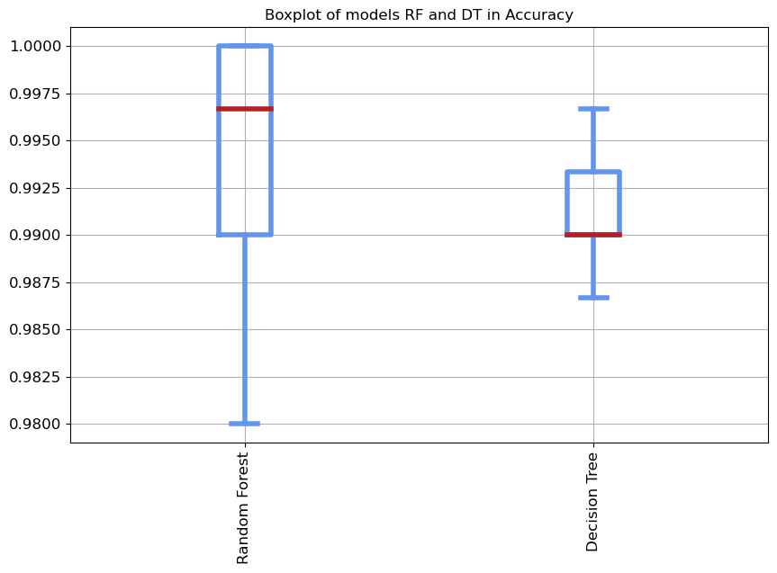

# cardiotocografia
Dados obtidos da plataforma [UCI Machine Learning](https://archive.ics.uci.edu/)  
Link para a Base de dados [link](https://archive.ics.uci.edu/dataset/193/cardiotocography)  
Pipeline desenvolvido por [Marcelo Passamai Mendes](https://www.linkedin.com/in/marcelo-mendes/)  
## Importando a bibliotecas


```python
!pip install ipywidgets > /dev/null & echo 'Library ipywidgets Installed'
!pip install imblearn > /dev/null & echo 'Library imblearn Installed'
!pip install shap > /dev/null & echo 'Library Shap Installed'
```

    Library ipywidgets Installed
    Library imblearn Installed
    Library Shap Installed


```python
import pandas as pd
import matplotlib.pyplot as plt
from ydata_profiling import ProfileReport
from imblearn.pipeline import Pipeline
from imblearn.under_sampling import RandomUnderSampler
from imblearn.over_sampling import RandomOverSampler
from sklearn.model_selection import train_test_split
from sklearn.preprocessing import StandardScaler
from sklearn.tree import DecisionTreeClassifier
from sklearn.model_selection import GridSearchCV
from sklearn.ensemble import RandomForestClassifier

import warnings
warnings.filterwarnings("ignore", message=".*The 'nopython' keyword.*")
```

## Importando a base de dados


```python
df_description = pd.read_excel(\
                        'CTG.xls', sheet_name = 'Description',\
                         usecols = 'C:D', skiprows = 6, nrows=38,\
                         names = ['Feature','Description']      
                    )
```


```python
df = pd.read_excel(\
            'CTG.xls', sheet_name = 'Raw Data',usecols = 'D:AN')
df = df.drop(0, axis = 0)
df = df.drop([2129, 2128, 2127], axis = 0)
```

## FAST EDA
**Exploratory data analysis**  
Biblioteca usada [ydata-profiling](https://github.com/ydataai/ydata-profiling) 


```python
profile = ProfileReport(df, title="Profiling Report")
profile.to_file("report.html")
```

Foi realizado uma análise incial usando a biblioteca ydata_profiling, no link a seguir:  
[ydata_report](report.html)  

### considerações 
1. Baixa variabilidade  
As colunas DS,DP,DR tem variabilidade menor que 1% sendo muito baixo podendo ser considerado constante, serão removidas por isso.  

2. Alta correlação  
Coluna CLASS tem uma correlação muito alta com as colunas A,B,C,D,E,AD,DE,FS,SUSP e NSP, por esse motivo será removida. Além disso, há uma correlação forte entre as colunas: LB e LBE, representando o baseline do sistema (sisporto) e (expecialista), porém não serão removidas.  

3. Balanceamento de carga  
Existe desbalanceamento de carga muito alto nacoluna alvo NSP por esse motivo recomento uma estratégia de balanceamento de carga antes da construção do modelo.


```python
df = df.drop(['CLASS','DR','DS','DP'], axis = 1)
```

## Pipeline

https://lerekoqholosha9.medium.com/random-oversampling-and-undersampling-for-imbalanced-classification-a4aad406fd72


```python
X = df.drop('NSP', axis = 1)
y = df['NSP']
```


```python
ros = RandomOverSampler(sampling_strategy = {2.0:500,3.0:500}, random_state = 42)
```


```python
rus = RandomUnderSampler(sampling_strategy = 'majority', random_state = 42)
```


```python
# Decision tree
param_dt = {'criterion':['gini', 'entropy', 'log_loss'],\
           'max_depth':[2,3,4,5,7],}

# Random Forest
params_rf = {'n_estimators':[100,150,200,250,300,700],\
             'max_depth':[2,3,4,5,6,7,],\
             'criterion':['gini', 'entropy', 'log_loss'],}


models = [ (DecisionTreeClassifier(), param_dt, 'Decision Tree'),\
           (RandomForestClassifier(), params_rf, 'Random Forest')]
```


```python
X_train, X_test, y_train, y_test = train_test_split(X, y, random_state = 42)
cv = 5
df_result = pd.DataFrame()
classifier_list = []

for model_ in models:
    grid = GridSearchCV(model_[0], param_grid = model_[1], cv = cv,\
                        n_jobs = -1, scoring = 'accuracy')
    pipe = Pipeline(
        [('Rand_Over_Sample',ros),\
         ('Rand_Under_Sample',rus),\
         ('scaler', StandardScaler()),\
         (model_[2], grid)])

    pipe.fit(X_train, y_train)
    #pipe.score(X_test, y_test)
    index = pipe[model_[2]].best_index_
    cv_results = pipe[model_[2]].cv_results_
    df_result[model_[2]] = [cv_results[f"split{i}_test_score"][index] for i in range(cv)]
    
    # Salvo para acessar o modelo desejado
    # criado pelo pipeline em caso de uso
    # em produção ou para uso de explicabilidade como o shap
    #classifier_list['Decision Tree'].best_estimator_
    #classifier_list.predict(X_test)
    classifier_list.append(pipe)
```


```python
def boxplot_sorted(df, score, title, rot=90, figsize=(10,6), fontsize=12):
    df2 = df
    meds = df2.median().sort_values(ascending=False)
    axes = df2[meds.index].boxplot(figsize=figsize, rot=rot, fontsize=fontsize,
                                   boxprops=dict(linewidth=4, color='cornflowerblue'),
                                   whiskerprops=dict(linewidth=4, color='cornflowerblue'),
                                   medianprops=dict(linewidth=4, color='firebrick'),
                                   capprops=dict(linewidth=4, color='cornflowerblue'),
                                   flierprops=dict(marker='o', markerfacecolor='dimgray',
                                        markersize=12, markeredgecolor='black'),
                                   return_type="axes")
    axes.set_title(title, fontsize=fontsize)
    plt.savefig(title + '.pdf')
    plt.show()
```


```python
boxplot_sorted(df_result,'Accuracy','Boxplot of models RF and DT in Accuracy')
```


    

    


```python
classifier_list[1]['Random Forest'].best_estimator_
```
RandomForestClassifier(criterion=&#x27;log_loss&#x27;, max_depth=7, n_estimators=200)


